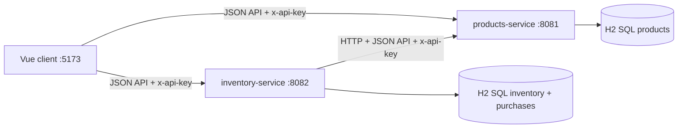
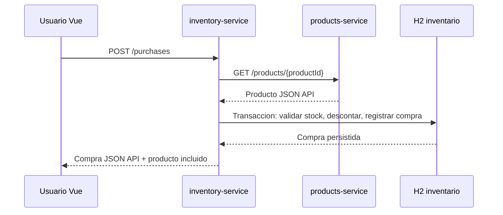

# Prueba tecnica: Vue + Spring Boot

Solucion para dos microservicios backend y una interfaz web:

- `products-service`: Spring Boot, productos, H2 SQL.
- `inventory-service`: Spring Boot, inventario, compras, historial, H2 SQL.
- `frontend`: Vue 3 + Vite para operar productos, stock y compras.

Todas las respuestas backend usan JSON API. Los endpoints funcionales requieren `x-api-key`; los health checks quedan abiertos para Docker y monitoreo.

## Arquitectura



## Flujo de compra



El endpoint de compra esta en `inventory-service` porque el inventario es el agregado que conoce disponibilidad y puede hacer atomica la operacion de descontar stock y registrar la compra. `products-service` se mantiene limitado a informacion de catalogo.

## Decisiones tecnicas

- **Spring Boot 3.5.x + Java 21**: stack backend robusto y compatible con la familia 3.x estable.
- **Vue 3 + Vite**: cliente moderno y liviano para probar el flujo completo.
- **H2 SQL por microservicio**: cada servicio conserva su propia base. H2 permite SQL, persistencia local en archivo y arranque simple para la prueba. En produccion migraria a PostgreSQL.
- **JSON API**: respuestas con `data`, `type`, `id`, `attributes`, `relationships`, `included` y `errors`.
- **API key entre servicios**: `inventory-service` llama a `products-service` con `x-api-key`.
- **Timeout y reintentos**: el cliente HTTP de productos en inventario usa `HttpClient`, timeout configurable y reintentos ante fallos temporales.
- **Consistencia**: la compra se ejecuta con `@Transactional` dentro de inventario.

## Requisitos

- Java 21 y Maven 3.9+, o Docker Desktop.
- Node.js 22+ para ejecutar el frontend localmente.

## Ejecucion con Docker

```bash
docker compose up --build
```

URLs:

- Vue: `http://localhost:5173`
- Productos: `http://localhost:8081`
- Inventario: `http://localhost:8082`
- Swagger productos: `http://localhost:8081/swagger-ui.html`
- Swagger inventario: `http://localhost:8082/swagger-ui.html`
- API key: `local-dev-key`

## Ejecucion local

Backend:

```bash
cd backend
mvn test
mvn -pl products-service spring-boot:run
```

En otra terminal:

```bash
cd backend
mvn -pl inventory-service spring-boot:run
```

Frontend:

```bash
cd frontend
npm install
npm run dev
```

## Ejemplos API

Crear producto:

```bash
curl -X POST http://localhost:8081/products \
  -H "x-api-key: local-dev-key" \
  -H "Content-Type: application/vnd.api+json" \
  -d '{"data":{"type":"products","attributes":{"name":"Keyboard","price":125500,"description":"Mechanical keyboard"}}}'
```

Actualizar inventario:

```bash
curl -X PUT http://localhost:8082/inventory/PRODUCT_ID \
  -H "x-api-key: local-dev-key" \
  -H "Content-Type: application/vnd.api+json" \
  -d '{"data":{"type":"inventories","attributes":{"quantity":10}}}'
```

Comprar:

```bash
curl -X POST http://localhost:8082/purchases \
  -H "x-api-key: local-dev-key" \
  -H "Content-Type: application/vnd.api+json" \
  -d '{"data":{"type":"purchases","attributes":{"productId":"PRODUCT_ID","quantity":2}}}'
```

## Endpoints

Productos:

- `GET /health`
- `GET /actuator/health`
- `POST /products`
- `GET /products`
- `GET /products/{id}`

Inventario:

- `GET /health`
- `GET /actuator/health`
- `GET /inventory/{productId}`
- `PUT /inventory/{productId}`
- `POST /purchases`
- `GET /purchases`

La especificacion OpenAPI esta en [`docs/openapi.yaml`](docs/openapi.yaml).

Con los servicios levantados, Swagger UI queda disponible en:

- Productos: `http://localhost:8081/swagger-ui.html`
- Inventario: `http://localhost:8082/swagger-ui.html`

Los contratos generados en runtime quedan en:

- Productos: `http://localhost:8081/v3/api-docs`
- Inventario: `http://localhost:8082/v3/api-docs`

## Postman

Coleccion local:

- [`docs/postman_collection.json`](docs/postman_collection.json)
- [`docs/postman_environment.json`](docs/postman_environment.json)

Importa ambos archivos en Postman, selecciona el ambiente `Inventory Vue Spring Boot - Local` y ejecuta primero `Products / Create product`. Esa peticion guarda automaticamente `productId` para las peticiones de inventario y compras.

## Testing

Pruebas incluidas:

- Creacion de productos.
- Proteccion con API key.
- Producto no encontrado.
- Consulta y actualizacion de inventario.
- Compra exitosa con descuento de stock.
- Compra rechazada por inventario insuficiente.
- Validacion de payloads JSON API.

Comando:

```bash
cd backend
mvn test
```

## Git Flow

El repositorio aplica Git Flow para separar desarrollo, integracion y versiones
estables. Las funcionalidades se desarrollan en ramas `feature/*`, se integran
en `develop` y se publican en `main` mediante una rama `release/*`.

| Rama | Proposito |
| --- | --- |
| `main` | Contiene exclusivamente versiones estables listas para entrega. Cada version publicada queda identificada con un tag, como `v1.0.0`. |
| `develop` | Rama principal de integracion. Reune las funcionalidades terminadas antes de preparar una release. |
| `feature/products-service` | Implementacion del microservicio de productos, JSON API, persistencia, Swagger y pruebas. |
| `feature/inventory-service` | Implementacion del microservicio de inventario, compras, comunicacion HTTP, API key, timeout, reintentos y pruebas. |
| `feature/vue-client` | Implementacion del cliente Vue para administrar productos, inventario y compras. |
| `feature/docs-and-deployment` | Docker Compose, Dockerfiles, OpenAPI, Postman, diagramas y documentacion inicial. |
| `feature/docs-git-flow` | Actualizaciones a la documentacion de la estrategia Git Flow. |
| `release/v1.0.0` | Validacion y preparacion de la primera entrega estable antes de fusionarla en `main`. |
| `release/v1.0.1` | Actualizacion documental de la entrega, sin cambios funcionales. |

Todas las ramas feature se fusionan en `develop` usando `--no-ff` para conservar
la trazabilidad. Una release validada se fusiona en `main`, se etiqueta y se
sincroniza nuevamente con `develop`.

El historial y los comandos utilizados se describen en
[`docs/git-flow.md`](docs/git-flow.md).

## Uso de IA

Se uso IA como apoyo para:

- Extraer requisitos del documento original.
- Separar responsabilidades entre productos, inventario y frontend.
- Generar contratos JSON API y casos de prueba.
- Revisar consistencia del flujo de compra, API key, timeout y reintentos.

La calidad se valido con build del frontend, pruebas automatizadas del backend, revision de la pantalla en navegador local y revision manual contra el enunciado.
